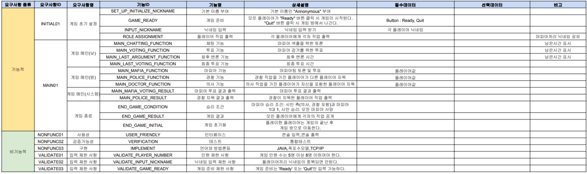
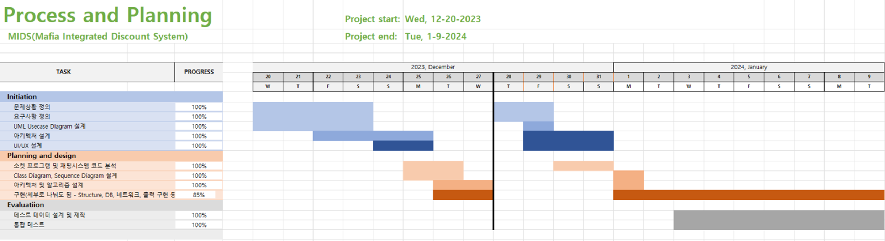
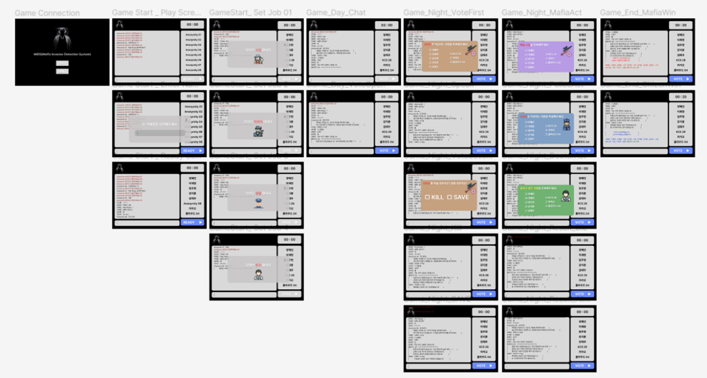
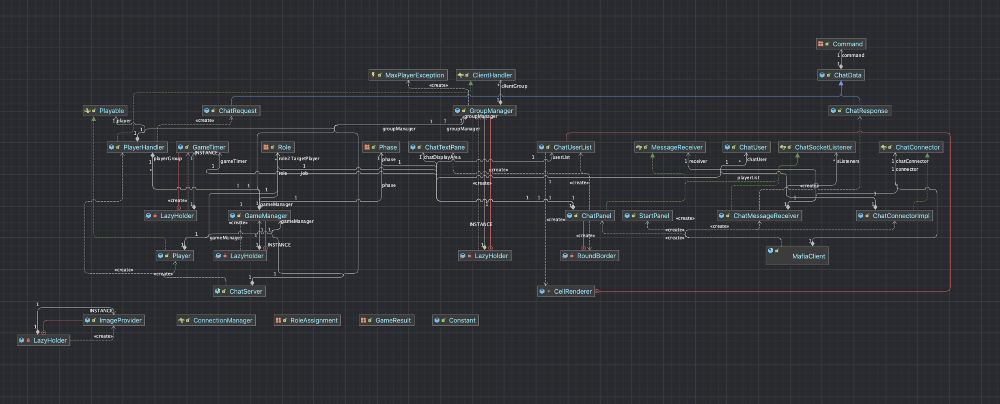
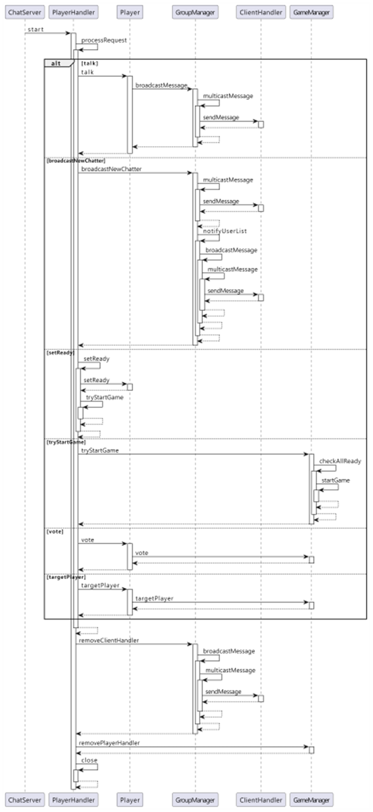
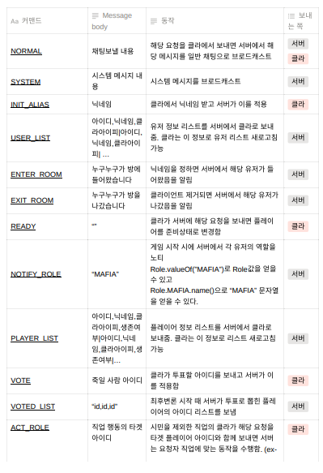
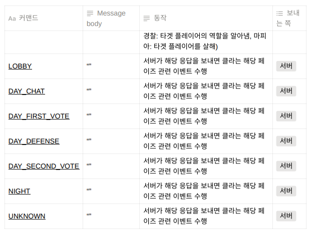

# MIDS(Mafia Invasion Detection System)
##### 강지훈, 김태우, 양혜인, 이재현, 임주현

---

### 1. 게임 개요

마피아 게임은 마피아와 시민 그룹으로 나뉘어 상호작용하는 심리 추리 게임입니다.
게임의 목표는 마피아가 모든 시민을 제거하거나 시민이 모든 마피아를 찾아내는 것입니다.

### 2. 플레이어 및 게임 세팅

- 게임은 5~8명의 플레이어로 구성됩니다.
    - 접속 시에 플레이어 이름을 입력하며 중복을 허용하지 않습니다.
    - 접속 인원이 5~8명인 상태로 모든 인원이 “Ready” 선언 하면 게임이 시작됩니다.
    - 모든 접속 인원이 “Ready”하여도 인원수가 5 이상 있지 않다면 시작되지 않습니다.
    - 게임방은 8명까지 접속 가능합니다.
- 게임 시작 직후 각 플레이어는 무작위로 시민, 마피아, 의사, 경찰 중 하나의 역할을 부여받습니다.
- 게임의 인원수에 따라 각 역할 별 인원수가 정해집니다.
    - 5인: 시민(3), 마피아(1), 의사(1)
    - 6인: 시민(3), 마피아(1), 의사(1), 경찰(1)
    - 7인: 시민(3), 마피아(2), 의사(1), 경찰(1)
    - 8인: 시민(4), 마피아(2), 의사(1), 경찰(1)

### 3. 게임 진행

- 게임은 낮과 밤의 사이클로 진행됩니다.

```
  [낮] : (전날 결과 통지) → 채팅(3분) → 투표1(30초)→ 최후 변론(30초) → 투표2(30초) → 선택 반영
    1. 전날 결과 통지: 전날 밤에 죽은 플레이어를 알려줍니다. (ex - “밤 사이에 플레이어 XXX가 죽었습니다.” or “밤 사이에 아무도 죽지 않았습니다.”)
    2. 채팅: 플레이어 간에 누구를 죽일 지 의논합니다.
    3. 투표1: 누구를 죽일 지 1차 투표를 진행합니다.
    4. 최후 변론: 1차 투표에서 선정된 플레이어가 최후 변론을 합니다.
    5. 투표2: 누구를 죽일 지 최후 투표를 진행합니다.
    6. 선택 반영: 선정된 플레이어를 제거 합니다.
        - 투표 결과가 동률인 경우 랜덤으로 한 명을 제거합니다.(2차에도 동점일 때)
        - 아무도 투표하지 않았다면 아무도 죽지 않습니다.
```

```
  [밤] : 각 직업 논의 및 행동 선택(30초) → 선택 반영
    1. 밤 시간 직업 행동: 
        - 시민: 아무 행동도 할 수 없습니다.
        - 마피아: 마피아끼리 마피아를 제외한 플레이어 중에 죽일 플레이어를 논의합니다. 마피아들 중 먼저 선택한 플레이어가 결과에 반영됩니다.
        - 의사: 마피아 공격으로부터 보호할 플레이어를 선택합니다. 선택된 플레이어는 밤 사이 마피아에게 지목되어도 죽지 않습니다.
        - 경찰: 플레이어 중 한 명을 선택하여 정체를 알 수 있습니다.
    2. 선택 반영:
        - 마피아에 의해 시민 살해: “밤 사이에 플레이어 XXX가 죽었습니다.”
        - 마피아에 의해 시민이 지목되었지만 의사가 살림: “밤 사이에 아무도 죽지 않았습니다.”
        - 마피아가 아무도 지목하지 않음: “밤 사이에 아무도 죽지 않았습니다.”
```

- 다음 사이클의 낮: 종료 조건 확인 후 재개 or 종료
    - 종료 조건:
        - 시민 측 승리: 마피아가 모두 사망
        - 마피아 측 승리: 시민 측 플레이어(시민+의사+경찰)와 마피아가 1대 1인 경우
    - 종료 후 처리:
        - 각자의 직업을 공개합니다.
        - 모든 플레이어는 Ready가 해제된 상태로 Lobby에 보내집니다.

### 4. 사용자 인터페이스

- 플레이어는 텍스트 기반 인터페이스를 통해 서로 소통하고 게임을 진행합니다.
- 플레이어는 명령어 입력을 통해 의사결정을 서버에 전송합니다.

### 5. 서버 기능

- 서버는 게임의 상태를 관리하고 모든 플레이어의 선택을 조정합니다.
- 서버는 게임의 사이클을 제어하고 각 단계에서 플레이어의 입력을 받습니다.
- 서버는 플레이어의 선택에 따라 게임 상황을 업데이트하고, 플레이어에게 결과를 통보합니다.

### 6. 클라이언트 기능

클라이언트는 서버로부터 게임 상태 정보를 받고 사용자의 입력을 서버에 전송합니다.
클라이언트는 사용자에게 현재 게임 상태를 표시하고 사용자의 선택을 입력받을 수 있는 인터페이스를 제공합니다.

### 7. 네트워킹

게임은 클라이언트-서버 모델을 사용하여 네트워크 통신을 합니다.
플레이어 간의 실시간 통신을 위해 소켓 프로그래밍을 사용합니다.

### 8. 보안 요구사항

플레이어의 역할과 선택은 보안을 유지하며 서버와 클라이언트 간에 전송되어야 합니다.
게임 데이터는 무단 액세스로부터 보호되어야 합니다.

### 9. 예외 및 오류 처리

네트워크 지연이나 중단 상황을 처리할 수 있는 메커니즘이 필요합니다.
사용자의 잘못된 입력은 적절한 오류 메시지와 함께 처리되어야 합니다.

### 10. 테스트 요구사항

게임은 다양한 시나리오에서 테스트되어야 합니다.
테스트는 서버의 안정성, 클라이언트의 반응성, 네트워크 통신의 신뢰성을 검증해야 합니다.의 신뢰성을 검증해야 합니다.

---
### 1. 요구사항정의서


### 2. Usecase Diagram


### 3. 간트차트


### 4. UIUX


### 5. Class Diagram


### 6. Sequence Diagram


### 7. API 명세
##### 1. 기본 포맷
- “ [커맨드] 내용 ”

##### 2. 커맨드의 종류

```
NORMAL
SYSTEM
INIT_ALIAS
USER_LIST
ENTER_ROOM
EXIT_ROOM
READY
NOTIFY_ROLE
PLAYER_LIST
VOTE
VOTED_LIST
ACT_ROLE
LOBBY
DAY_CHAT
DAY_FIRST_VOTE
DAY_DEFENSE
DAY_SECOND_VOTE
NIGHT
UNKNOWN
```

##### 3. 커맨드 별 동작



### 8. Github
https://github.com/KCS-First-Project

### 9. 발표자료
[KCS_Team1_FirstProject.pptx](img/KCS_Team1_FirstProject.pptx)